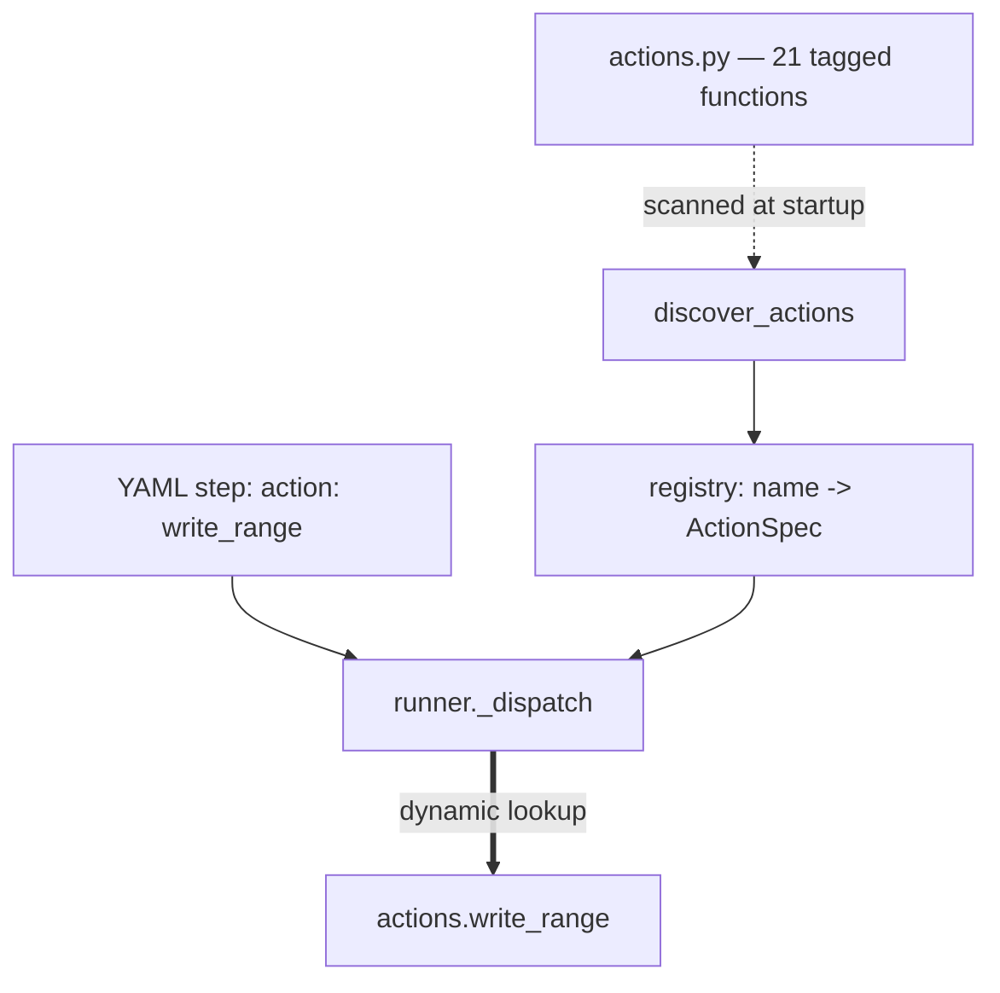

# Concept: the action registry

**You will not find the call site for `write_range`. There isn't one.**

This is the single biggest obstacle to reading this codebase, and it's
deliberate.

The dashed and bold edges are the ones no static analysis tool will show you.

## How it works

1. At startup, `discover_actions` scans the actions module for
   capability-tagged functions.
2. For each, it builds an `ActionSpec`: the name, the callable, its capability,
   its description (first docstring line) and a parameter schema derived from
   the function signature.
3. At execution, `_dispatch` takes `action: write_range` from the YAML, looks
   the name up in that dict, and calls whatever it finds.

## Why it's done this way

Adding an action is one function plus a tag. No registration list, no import to
update, no dispatch `if/elif` chain to extend. For a system whose whole purpose
is "lots of small operations", that's the right trade.

## What it costs you

- **"Find all references" returns nothing** for every action function.
- **Dead-code tools flag all 21 as unused.** That's why the repo has a
  `vulture_whitelist.py`.
- **Any generated call graph will show actions as unreachable**, or reachable
  only from tests. That's a false negative, not a finding.

## How to navigate it anyway

- The YAML `action:` name **is** the function name in
  [actions](../reference/mod-actions.md). That's the lookup table.
- `list_actions()` prints the live registry — the most reliable answer to
  "what can a step do", because it's derived from the code rather than docs.
- The tests are one file per action, so `tests/actions/test_write_range.py` is
  the fastest route to "what is this supposed to do".

## Where it lives

- [engine.discover_actions](../reference/mod-engine.md)
- [runner._dispatch](../reference/mod-runner.md)
- [actions](../reference/mod-actions.md)
- Route: [step 4](../route-run-a-workflow/r4-prepare-the-run.md),
  [step 5](../route-run-a-workflow/r5-execute-each-step.md)
