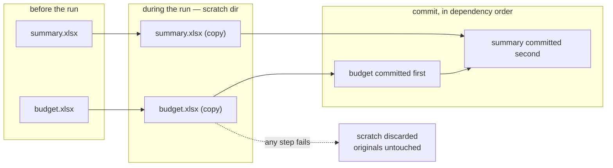

# Concept: scratch and commit

**Your original workbooks are not touched until the run succeeds.**

Any workbook a step intends to write is copied into a scratch directory before
execution. Steps operate on the copy. Only at the end are copies moved back.

## Why

Excel automation half-fails constantly — a locked file, a COM timeout, a
missing sheet on step 19 of 25. Without staging you'd be left with workbooks in
a partially-modified state and no way back.

## Why commit order is a real problem

Workbooks link to each other. If `summary.xlsx` has an external link to
`budget.xlsx` and both were written this run, committing them in the wrong
order leaves one pointing at a stale file — or at a scratch path that's about
to vanish.

`compute_link_commit_order` topologically sorts the write-intent workbooks so
each lands after everything it depends on. A dependency cycle is rejected
during [validation](../route-run-a-workflow/r3-validate.md), long before
commit — so by the time you reach commit, a valid order is guaranteed to exist.

## What you'll notice as a user

- A failed run leaves your files exactly as they were.
- The audit log is written **as the run proceeds**, not at commit, so it
  survives a crash and tells you how far it got.
- Read-only workbooks are never staged — only write-intent ones.

## Where it lives

- [engine.ScratchManager](../reference/mod-engine.md)
- [engine.compute_link_commit_order](../reference/mod-engine.md)
- Route: [step 4](../route-run-a-workflow/r4-prepare-the-run.md) and
  [step 6](../route-run-a-workflow/r6-commit-and-audit.md)
