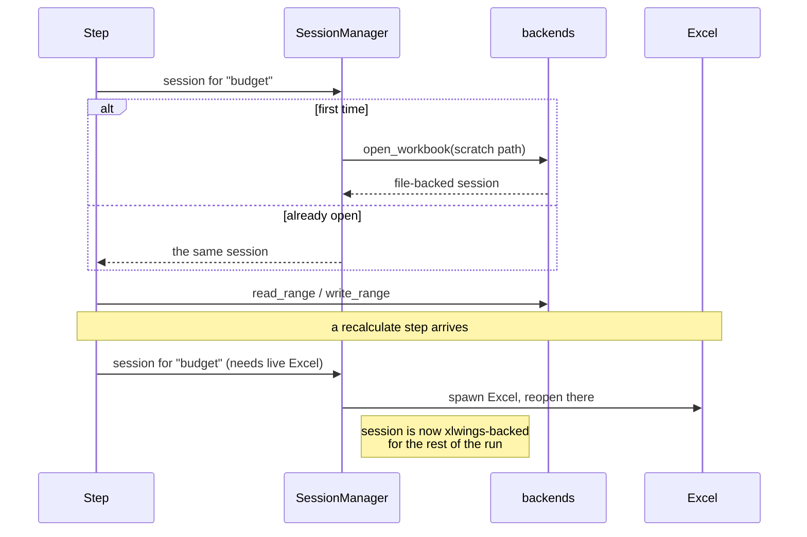

# Concept: sessions

A **session** is one open workbook, held for the duration of a run.

Steps never open files. They ask for a workbook by its logical name and get
back a session that's already open.

## Why it works this way

Opening a workbook is expensive — very expensive with real Excel. A workflow
with 30 steps against one workbook would otherwise open it 30 times.

## The consequence that will surprise you

**A session can change backend mid-run.** Most actions work on files via
openpyxl with no Excel process at all. `recalculate` can't — formulas need a
real calculation engine. So requesting it promotes that workbook's session to
xlwings, and it stays there.

Everything after that point for that workbook goes through the `xlw_` twins in
[backends](../reference/mod-backends.md), with different performance and
different failure modes. If a workflow behaves oddly only after a
`recalculate`, this is why.

## Teardown

At the end of a run, `close_all()` closes every session it's still tracking,
then `OwnedInstanceRegistry` quits **only the Excel processes this run
spawned**. An Excel you already had open is never touched.

One sharp edge: an explicit `close` action must make the session manager forget
that session, or teardown closes it twice — harmless on files, fatal on COM.

## Where it lives

- [engine.SessionManager](../reference/mod-engine.md)
- [backends.OwnedInstanceRegistry](../reference/mod-backends.md)
- Route: [step 4](../route-run-a-workflow/r4-prepare-the-run.md)
