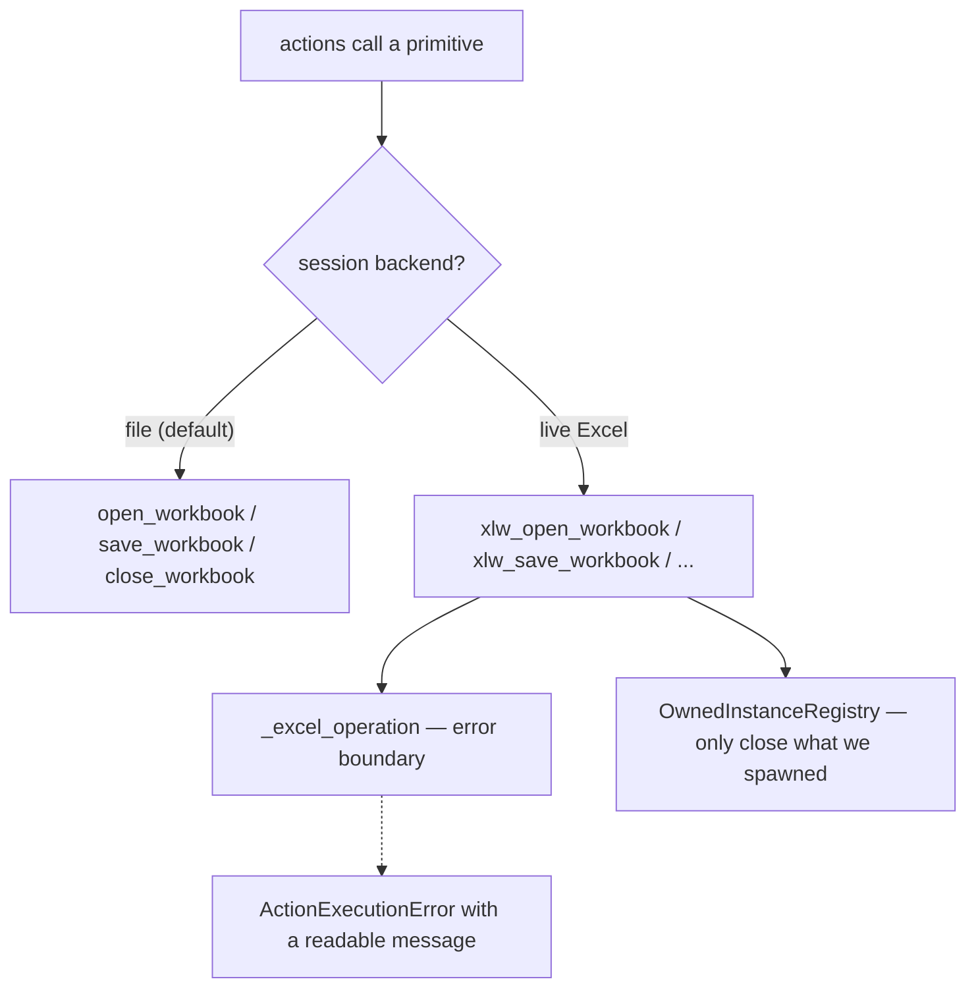

# backends

`excel_runner/backends.py` · **1,671 lines** · **live** · [start here](../start-here.md)

> Backend primitives: openpyxl (files) and xlwings (live Excel).

The lowest layer — nothing here knows what a workflow is. It only knows how to
open, read, write and close a spreadsheet.

## The one thing to understand

**Almost every primitive exists twice.** A file version using openpyxl, and a
live-Excel twin using xlwings/COM. The prefix tells you which:

| Prefix | Backend | When |
|---|---|---|
| _(none)_ | openpyxl, files only | The default for nearly everything |
| `xlw_` | xlwings, live Excel | Once a session has been promoted |
| `com_` | raw COM, live Excel | Link manipulation, which xlwings doesn't cover |

## What's in here

71 symbols. The ones worth knowing:

| Symbol | One-liner |
|---|---|
| `open_workbook` / `xlw_open_workbook` | Open an existing workbook |
| `create_workbook` | New workbook, blank or from a template |
| `save_workbook` / `xlw_save_workbook` | Save |
| `close_workbook` / `xlw_close_workbook` | Close, without quitting Excel |
| `close_open_workbook` | Close through whichever backend holds it |
| `_excel_operation` | Turns any live-Excel failure into `ActionExecutionError` |
| `_needs_vba_preserved` | Whether to ask openpyxl to keep the VBA project |
| `com_link_sources` / `com_change_link` | Read and repoint external links |
| `OwnedInstanceRegistry` | Tracks Excel processes *this run* spawned |

## Depends on

- [core](mod-core.md) — error types only
- _external:_ `openpyxl`, `xlwings`, `pywintypes`, `pathlib`

## Used by

- [actions](mod-actions.md), [engine](mod-engine.md)
- _22 test modules_

<!-- ── hand-written below, preserved on regeneration ─────────────── -->

## Notes

Two sharp edges, both learned the hard way:

- **`_excel_operation`** exists because a COM failure otherwise surfaces as an
  unreadable `pywintypes.com_error` traceback. `ValueError`,
  `NotImplementedError`, `FileNotFoundError` and `TimeoutError` deliberately
  pass through unwrapped — they're programming errors, not Excel errors.
- **`_needs_vba_preserved`** is gated on file extension. Opening an `.xlsm` for
  write without `keep_vba` silently drops the macros on save. That was a real
  data-loss bug.
