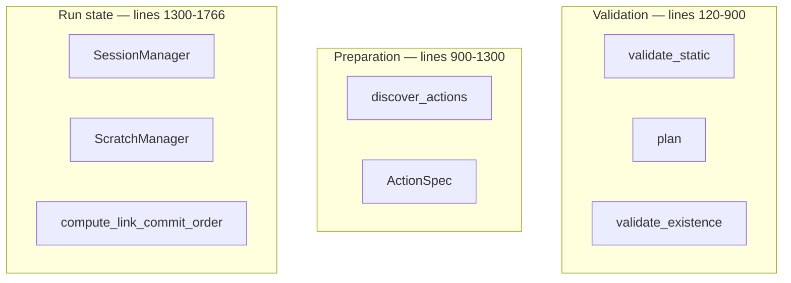

# engine

`excel_runner/engine.py` · **1,766 lines** · **live** · [start here](../start-here.md)

> Run-preparation and run-state layer: action discovery, session management,
> scratch staging, and three tiers of validation.

**Do not read this file top to bottom.** It's four unrelated responsibilities
in one file. Pick the one you need.

## Which part do you want?

| If you're asking... | Go to | Route step |
|---|---|---|
| "why was my workflow rejected?" | `validate_static`, `plan` | [3](../route-run-a-workflow/r3-validate.md) |
| "how does it find actions?" | `discover_actions`, `ActionSpec` | [4](../route-run-a-workflow/r4-prepare-the-run.md) |
| "why is my workbook still open?" | `SessionManager` | [4](../route-run-a-workflow/r4-prepare-the-run.md) |
| "where did my changes go?" | `ScratchManager` | [6](../route-run-a-workflow/r6-commit-and-audit.md) |
| "why this save order?" | `compute_link_commit_order` | [6](../route-run-a-workflow/r6-commit-and-audit.md) |

## What's in here

68 symbols. The 9 that matter:

| Line | Symbol | Kind | Reached | One-liner |
|---|---|---|---|---|
| 43 | `ActionSpec` | class | api | A discovered action: name, callable, capability, schema |
| 210 | `validate_static` | function | live | Tier 1: structural checks, one step at a time |
| 388 | `plan` | function | live | Tier 2: reasons across all steps |
| 612 | `validate_existence` | function | live | Tier 3 (opt-in): opens real workbooks read-only |
| 905 | `discover_actions` | function | live | Scan the actions module, build the registry |
| 1104 | `scan_external_link_targets` | function | live | Read external-link targets with no Excel involved |
| 1318 | `SessionManager` | class | live | One session per logical workbook, for the run |
| 1502 | `ScratchManager` | class | live | Stage writes, commit at the end |
| 1690 | `compute_link_commit_order` | function | live | Topologically order write-intent workbooks |

_59 further symbols (private helpers, mostly `_check_*` validators) —
they're the bulk of the line count and none of the interest._

## Depends on

- [core](mod-core.md), [backends](mod-backends.md)
- _external:_ `openpyxl`, `pathlib`, `shutil`, `zipfile`

## Used by

- [runner](mod-runner.md)
- _14 test modules_

<!-- ── hand-written below, preserved on regeneration ─────────────── -->

## Notes

This file is the strongest argument in the repo for splitting by
responsibility: validation, discovery and run-state share a file but not a
reason. If you're changing one, you almost never need the other two.
