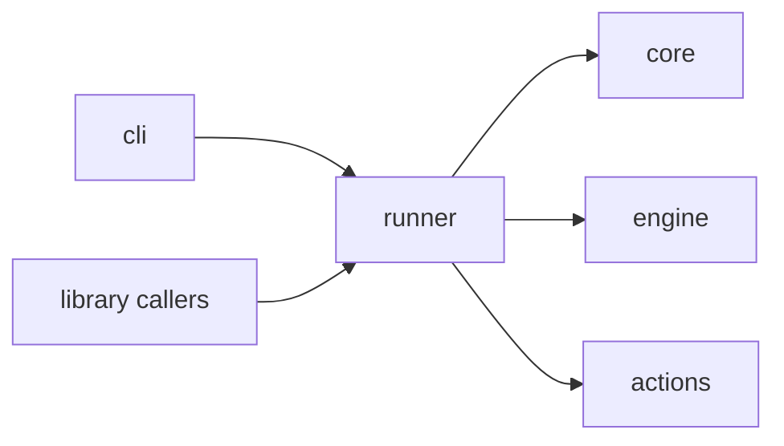

# runner

`excel_runner/runner.py` · 371 lines · **live** · [start here](../start-here.md)

> The composition root, audit logging, and the public API surface.

**If you read one file, read this one.** Everything else is a detail this file
orchestrates.

Appears in the route at [step 4](../route-run-a-workflow/r4-prepare-the-run.md),
[step 5](../route-run-a-workflow/r5-execute-each-step.md) and
[step 6](../route-run-a-workflow/r6-commit-and-audit.md).

## What's in here

| Line | Symbol | Kind | Reached | One-liner |
|---|---|---|---|---|
| 23 | `StepResult` | class | api | The outcome of one step |
| 45 | `RunResult` | class | api | The outcome of a full run |
| 61 | `AuditLogger` | class | live | One JSON record per step, to a JSONL file |
| 117 | `_dispatch_copy` | function | live | The two-workbook case — resolves both sessions |
| 152 | `_dispatch` | function | live | Resolve one step's params and call its action |
| 194 | `run_workflow` | function | **entry** | Load, validate and execute, end to end |
| 360 | `list_actions` | function | **entry** | Every action's name, capability, description, schema |

## Depends on

- [core](mod-core.md), [engine](mod-engine.md), [actions](mod-actions.md)
- _external:_ `dataclasses`, `datetime`, `json`, `logging`, `pathlib`

## Used by

- [cli](mod-cli.md)
- _9 test modules_

## Symbols

### run_workflow

`def run_workflow(path, env_overrides=None, working_dir=None, check_existence=False) -> RunResult`

Load, validate, and execute a workflow YAML file end to end. The whole system
in one function — 160 lines, and the single most valuable thing to read.

- **Calls:** [core.load](mod-core.md), [engine.discover_actions](mod-engine.md),
  [engine.validate_static](mod-engine.md), [engine.plan](mod-engine.md),
  [engine.validate_existence](mod-engine.md), [engine.ScratchManager](mod-engine.md),
  [engine.SessionManager](mod-engine.md),
  [engine.compute_link_commit_order](mod-engine.md), `_dispatch`, `AuditLogger`
- **Called by:** [cli.main](mod-cli.md)
- **Called by tests:** 14 test symbols

> ⚠️ 12 outgoing calls. This is the fan-out point of the system — it's meant to
> be read as the [route](../route-run-a-workflow/r1-you-run-the-command.md),
> not as a call list.

### _dispatch

`def _dispatch(step, sessions, registry, env) -> StepResult`

Resolve one step's params and call its action.

- **Calls:** [core.resolve_value](mod-core.md), registry lookup (dynamic — target not resolvable statically)
- **Called by:** `run_workflow`

<!-- ── hand-written below, preserved on regeneration ─────────────── -->

## Notes

`_dispatch` is where static analysis gives up: the action it calls is looked up
in a dict at runtime, so no tool will draw you an edge from here to
[actions](mod-actions.md). That edge is real; it's just invisible.
See [the action registry](../concepts/concept-action-registry.md).
