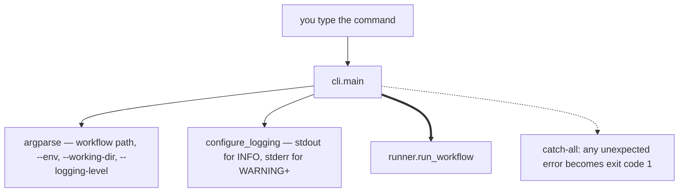

# 1. You run the command

```
excel-runner monthly-close.yaml --env output_folder=D:\out
```

Nothing has touched a spreadsheet yet. This step is about 40 lines of work.



## What actually happens

1. `argparse` parses the arguments. `--env` is parsed into `(key, value)`
   pairs; malformed values fail here, before anything else runs.
2. `configure_logging` attaches the **only** logging handlers in the whole
   project — stdout below WARNING, stderr at WARNING and above. Every other
   module just calls `logging.getLogger(__name__)` and configures nothing.
3. Everything is handed to `run_workflow`, which does all the real work.
4. A catch-all wraps the lot, so an unexpected exception becomes a clean exit
   code rather than a traceback in someone's CI log.

## Why it's this thin

The CLI exists so a workflow can be triggered from outside Python — a
scheduler, an orchestration tool, a batch file. It deliberately has no
behaviour of its own. The library entry point `run_workflow` is the real API;
the CLI is a wrapper around it.

That's why there's nothing to understand here, and why you should not spend
time in `cli.py`.

## The code

- [cli.main](../reference/mod-cli.md) — the whole of this step
- [runner.run_workflow](../reference/mod-runner.md) — where it hands off

---

Next: **[2. Load the workflow](r2-load-the-workflow.md)**
