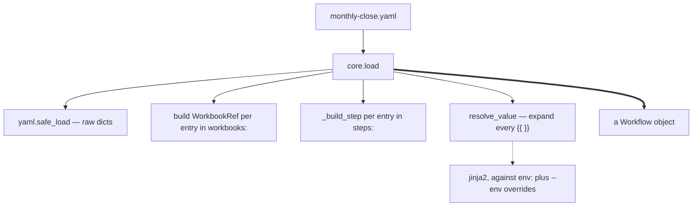

# 2. Load the workflow

Turn a YAML file into a `Workflow` object. Still no spreadsheet is touched.

## What a workflow is

Three things, and that's all:

| Part | Becomes | Meaning |
|---|---|---|
| `env:` | a dict | Values you can reference as `{{ name }}`, overridable from the CLI |
| `workbooks:` | `WorkbookRef` each | A *logical name* for a workbook, and where the file lives |
| `steps:` | `Step` each | An ordered list of things to do |

The logical-name indirection matters: steps say `workbook: budget`, never a
file path. That's what lets `--env` repoint a whole run at different files
without editing the YAML.

## Templating

`{{ }}` expressions are expanded during load, not during execution — so by the
time a step runs, every value is already a literal. `resolve_value` recurses
through nested dicts and lists, so templating works anywhere in a step's
parameters, not just at the top level.

One consequence worth knowing: **a template error is a load error.** You find
out before anything has run, which is the point.

## What can go wrong here

- Malformed YAML → fails immediately, nothing is opened.
- A `{{ }}` referencing an undefined name → load error, wrapped with the step
  it came from.
- A step naming a workbook that isn't in `workbooks:` → *not* caught here.
  That's the next step's job.

## The code

- [core.load](../reference/mod-core.md) — this whole step
- [core.resolve_value](../reference/mod-core.md) — templating
- [core.Workflow / Step / WorkbookRef](../reference/mod-core.md) — the model

---

Previous: [1. You run the command](r1-you-run-the-command.md)
Next: **[3. Validate](r3-validate.md)**
