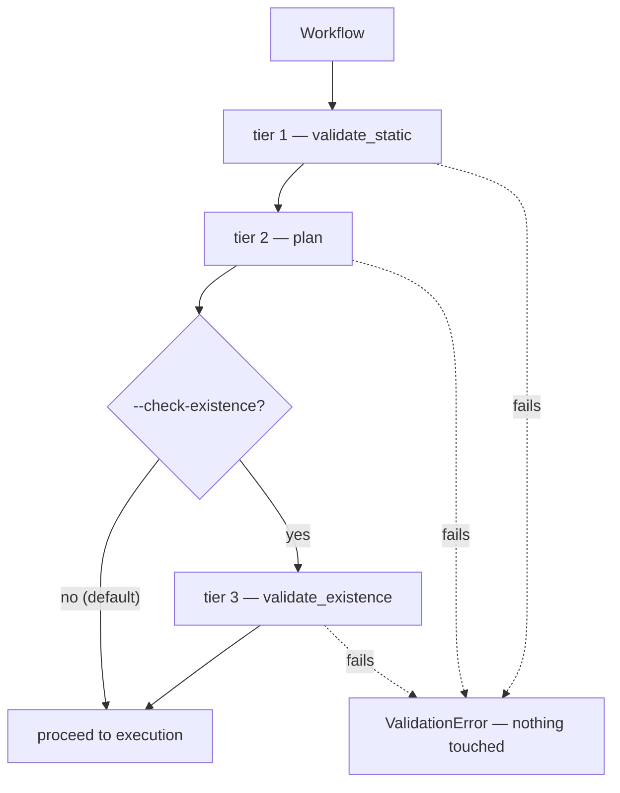

# 3. Validate

Three tiers, cheapest first. The design rule: **refuse a bad workflow before
touching a single real file.**

## The three tiers

| Tier | Function | Sees | Touches disk? |
|---|---|---|---|
| 1 | `validate_static` | One step at a time | No |
| 2 | `plan` | All steps together | No |
| 3 | `validate_existence` | The real workbooks | **Yes — read-only** |

**Tier 1** is structural: does this step name a real action, are its required
parameters present, are the types right. Per-step, no context.

**Tier 2** is where the interesting checks live, because it reasons across the
whole list: is every `workbook:` a step references actually declared, do the
steps form a sane order, can the link-commit order be computed. A step
referencing an undeclared workbook is caught here, not in tier 1.

**Tier 3** is opt-in (`--check-existence`) because it's the first thing that
costs real I/O — it opens every referenced workbook read-only and confirms
each sheet and defined name a step mentions actually exists. Worth it before a
long run; wasteful on every run.

## Why tier 3 is opt-in and not default

Opening every workbook is slow, and on the live-Excel backend it's *very*
slow. The tiers are ordered so that the fast checks catch most mistakes, and
you pay for the expensive one only when you want the reassurance.

## The code

- [engine.validate_static](../reference/mod-engine.md) — tier 1
- [engine.plan](../reference/mod-engine.md) — tier 2
- [engine.validate_existence](../reference/mod-engine.md) — tier 3
- [engine.compute_link_commit_order](../reference/mod-engine.md) — computed during tier 2, used much later in [step 6](r6-commit-and-audit.md)

---

Previous: [2. Load the workflow](r2-load-the-workflow.md)
Next: **[4. Prepare the run](r4-prepare-the-run.md)**
