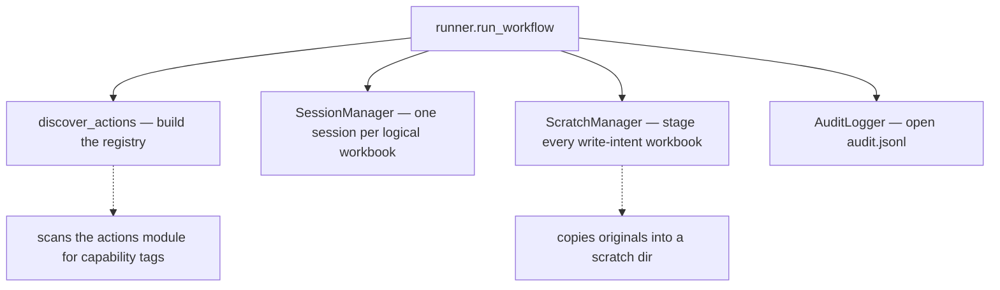

# 4. Prepare the run

Three things get set up before the first step executes. This is the part that
isn't obvious from reading the code, and the part that explains most of
`engine.py`.

## 1. The action registry

`discover_actions` scans the actions module and builds a name → function map,
deriving each action's parameter schema from its signature. Steps are matched
to actions by name at execution time.

This is why searching for who calls `write_range` finds nothing.
See [the action registry](../concepts/concept-action-registry.md).

## 2. Sessions

A workbook is opened **once per run**, not once per step. `SessionManager`
holds one session per logical workbook name and hands the same one to every
step that asks for it.

A session also knows which backend it's on, and can switch — `recalculate`
needs a real Excel process, so asking for it promotes that workbook's session
from openpyxl to xlwings. See [sessions](../concepts/concept-session.md).

## 3. Scratch

Every workbook a step intends to *write* is copied into a scratch directory
first. Steps operate on the copy. Originals are untouched until the commit in
[step 6](r6-commit-and-audit.md).

This is why a failed run leaves your files alone, and why the commit order at
the end is a real problem worth solving.
See [scratch and commit](../concepts/concept-scratch-commit.md).

## The code

- [engine.discover_actions](../reference/mod-engine.md)
- [engine.SessionManager](../reference/mod-engine.md)
- [engine.ScratchManager](../reference/mod-engine.md)
- [runner.AuditLogger](../reference/mod-runner.md)

---

Previous: [3. Validate](r3-validate.md)
Next: **[5. Execute each step](r5-execute-each-step.md)**
