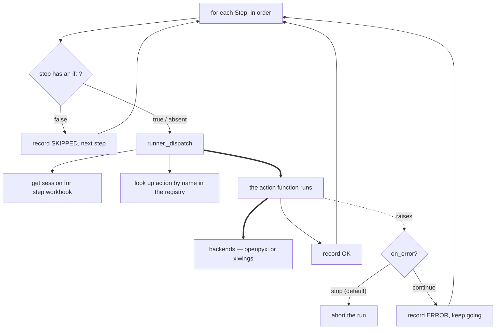

# 5. Execute each step

The loop. Everything above was preparation; this is the only part that changes
anything.

## One step, start to finish

1. **Condition.** If the step has an `if:` expression it's evaluated now
   against the environment. False means SKIPPED — recorded, not silent.
2. **Session.** `_dispatch` resolves `workbook: budget` into the live session
   for that logical name. `copy` needs two, which is why there's a separate
   `_dispatch_copy`.
3. **Lookup.** The action name is looked up in the registry built in
   [step 4](r4-prepare-the-run.md).
4. **Run.** The action function does the work through a backend primitive.
5. **Record.** A `StepResult` is appended to the audit log — OK, SKIPPED, or
   ERROR — whatever happened.

## Failure handling

The default is to stop. A step that raises aborts the run, nothing is
committed, and your original files are untouched because everything happened
in scratch.

`on_error: continue` records the error and carries on — useful for a batch of
independent steps, dangerous when later steps depend on earlier ones.

Either way the exit code is 1 if anything errored.

## Where the two backends diverge

Almost every action runs against files via openpyxl, with no Excel process
involved. The exception is `recalculate`, which needs real Excel — requesting
it switches that workbook's session to the xlwings backend for the rest of the
run. That's the single most surprising behaviour in the system.

## The code

- [runner._dispatch](../reference/mod-runner.md) — one step
- [runner._dispatch_copy](../reference/mod-runner.md) — the two-workbook case
- [actions](../reference/mod-actions.md) — all 21 of them
- [core.evaluate_condition](../reference/mod-core.md) — the `if:` expression

---

Previous: [4. Prepare the run](r4-prepare-the-run.md)
Next: **[6. Commit and audit](r6-commit-and-audit.md)**
