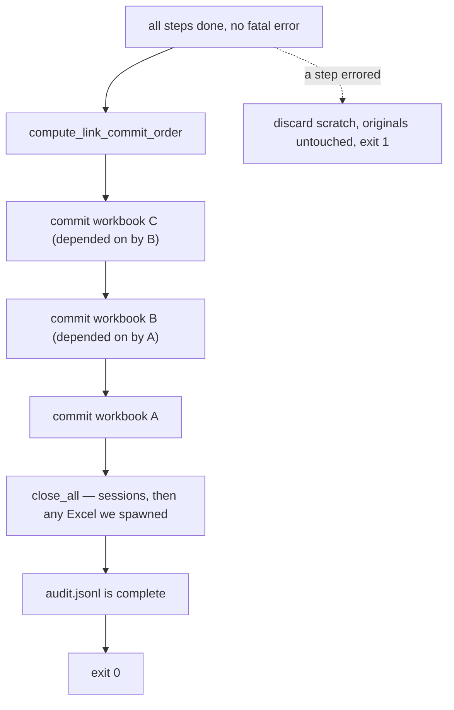

# 6. Commit and audit

Every step has run against scratch copies. Now the changes become real — in a
specific order, for a specific reason.

## Why order matters

Excel workbooks link to each other. If `A` has an external link to `B`, and
both were written this run, committing `A` before `B` leaves `A` pointing at a
stale `B` — or worse, at the scratch path.

`compute_link_commit_order` topologically sorts the write-intent workbooks so
each is committed only after everything it depends on. A cycle is a hard
error, raised back in [validation](r3-validate.md), not here — by the time you
reach commit, the order is already known to be valid.

## Closing down

Sessions are closed first, then the `OwnedInstanceRegistry` quits only the
Excel processes *this run spawned itself*. It will never close an Excel you
already had open — which is the entire reason that registry exists.

Note the sharp edge: an explicit `close` action mid-workflow must tell the
session manager to forget that session, or teardown tries to close it twice.
Harmless on files, fatal on live Excel.

## The audit log

`excel_runner_runs/<yaml_stem>/audit.jsonl` — one JSON record per step, plus
run-level events. This is the contract with whatever invoked the run: an
external caller reads this file rather than parsing stdout.

It is written **as the run proceeds**, not at the end, so it survives a crash.

## The code

- [engine.compute_link_commit_order](../reference/mod-engine.md)
- [engine.ScratchManager](../reference/mod-engine.md) — the commit itself
- [backends.OwnedInstanceRegistry](../reference/mod-backends.md)
- [runner.AuditLogger](../reference/mod-runner.md)

---

Previous: [5. Execute each step](r5-execute-each-step.md)

**End of the route.** Back to [start here](../start-here.md), or read about
[scratch and commit](../concepts/concept-scratch-commit.md) in full.
