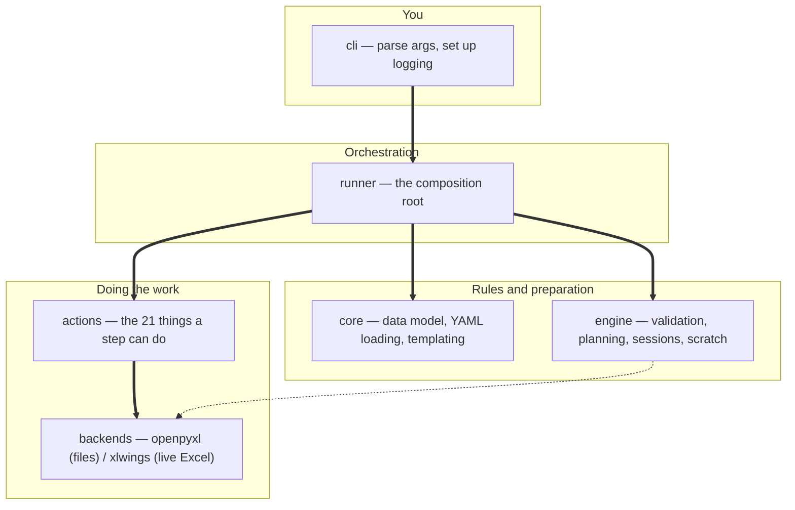

# excel-runner — start here

> **This is a mockup.** Hand-written to show what the generated output *could*
> look like. Details are plausible, not verified. Do not trust it as
> documentation for excel-runner; trust it only as a shape to argue with.

Declarative, YAML-driven Excel automation. You describe a workflow — open
workbooks, read and write ranges, chain steps — as data, and this runs it.

## Read this in 3 minutes

There are six source files. That's the whole thing.



`==>` means "calls into". `-.->` means "uses, but not on the main path".

| Layer | File | What it's for |
|---|---|---|
| 0 | [cli](reference/mod-cli.md) | The only place that touches logging handlers and `sys.exit`. Thin. |
| 1 | [runner](reference/mod-runner.md) | Wires everything together and owns the step loop. **Start here if you read only one file.** |
| 2 | [core](reference/mod-core.md) | What a workflow *is*: `Workflow`, `Step`, `WorkbookRef`, plus YAML loading and `{{ }}` templating. |
| 2 | [engine](reference/mod-engine.md) | The rules: three tiers of validation, plus session and scratch-file management. Biggest file. |
| 3 | [actions](reference/mod-actions.md) | One function per thing a workflow step can do: open, save, copy, write_range... |
| 3 | [backends](reference/mod-backends.md) | The two ways to touch a spreadsheet: openpyxl on files, xlwings on a live Excel. |

## How do I run it

```
excel-runner workflow.yaml
python -m excel_runner workflow.yaml
```

| Argument | Purpose |
|---|---|
| `workflow` | Path to the workflow YAML. The only required argument. |
| `--env KEY=VALUE` | Override an `env:` value. Repeat the flag, don't comma-separate. |
| `--working-dir` | Where `excel_runner_runs/<name>/` gets created. Defaults to cwd. |
| `--logging-level` | DEBUG / INFO / WARNING / ERROR. |
| `--check-existence` | Opt-in tier-3 validation — actually opens the workbooks first. |

Results land in `excel_runner_runs/<yaml_stem>/audit.jsonl`, one JSON record
per step. Exit code 0 means every step succeeded or was skipped.

Or use it as a library: `from excel_runner import run_workflow`.

## Follow a run from start to finish

The main route through the code, six steps, each one page:

**[1. You run the command](route-run-a-workflow/r1-you-run-the-command.md)** →
load → validate → prepare → execute → commit.

Each page says what happens, shows it as a diagram, and links to the code.

## Concepts worth knowing before you read code

- [Sessions](concepts/concept-session.md) — why a workbook is opened once per run, not per step.
- [Scratch and commit](concepts/concept-scratch-commit.md) — why writes don't hit your files until the end.
- [The action registry](concepts/concept-action-registry.md) — why you can't find the call site for `write_range`.

## Where the bodies are buried

- `engine.py` and `backends.py` are both over 1,300 lines. Don't read them top
  to bottom — use the route above and jump in.
- Every `xlw_`/`com_` function in backends has a file-based twin. Two
  implementations of the same idea, chosen at runtime. See
  [backends](reference/mod-backends.md).
- Actions are never called by name anywhere. See
  [the action registry](concepts/concept-action-registry.md) before you go
  looking for a caller.

---

_Graph view tip: filter to `path:route-` to see just the spine of the run,
without this page pulling everything into a ball._
